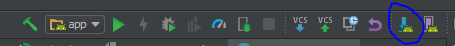
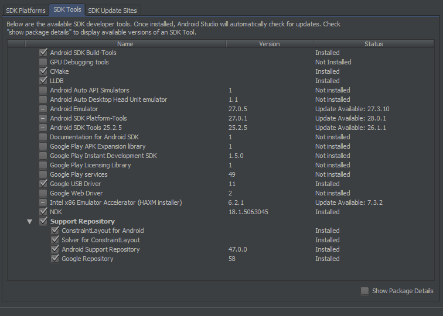

# Projekt zepsołowy.

## wefwds
Aplikacja mobilna, która ma za zadanie zczytywać nuty ze zdjeć lub obrazów.

# Jak przygotować środowisko?

Instalacja android studio: https://developer.android.com/studio/install

Pobieramy repozytorium `git clone ...`

Otwieramy projekt w Android Studio.

Następnie otworzyć SDK Manager i przejść do SDK Tools - zaznaczyć wszystko w ten sam sposób jak na obrazku:

Ok, chwila prawdy - zbuduj projekt, czyli kliknij w ikonę kilofa, w prawym górnym rogu.

Jak nie ma errors to możesz cieszyć się naszą zaawansowaną aplikacją w innym przypadku

skonsultuj się z lekarzem lub farmaceutą.

### Contributors:
[GitHub OJ](https://github.com/Oskii2311)
[GitHub JSH](https://github.com/kubzoey95)

